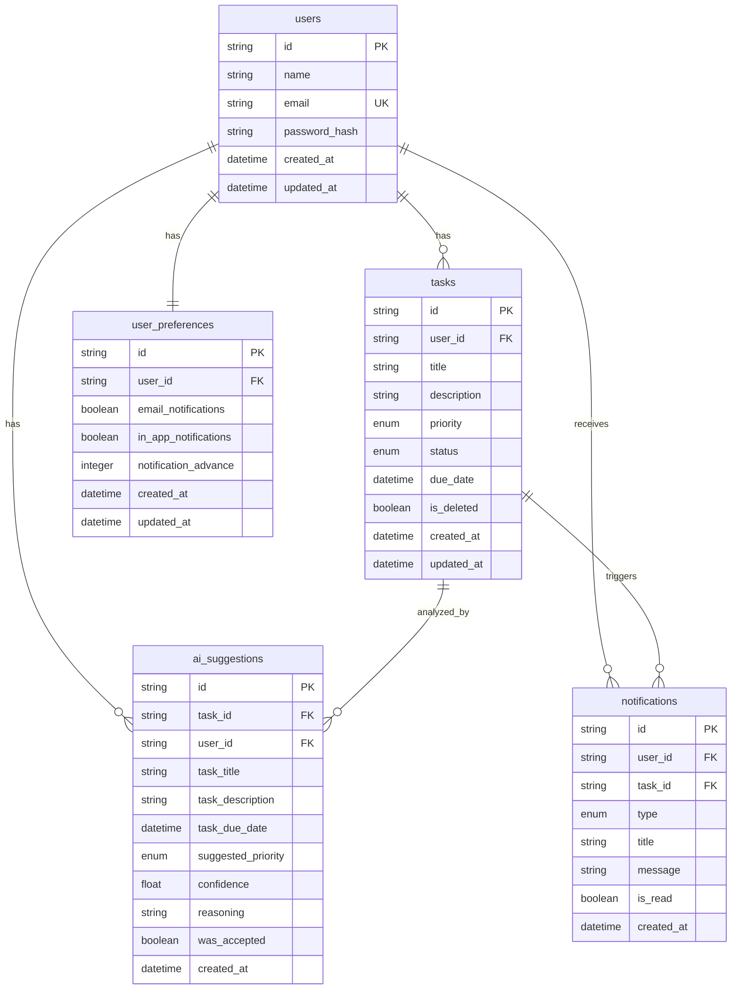

# Documentação do Banco de Dados - Task IA

## 📊 Visão Geral

O banco de dados do Task IA foi projetado seguindo princípios de normalização e performance, utilizando SQLite para desenvolvimento e preparado para migração futura para PostgreSQL em produção.

## 🗂️ Estrutura das Tabelas

### 👤 `users` - Usuários do Sistema

| Campo           | Tipo     | Constraints      | Descrição                  |
| --------------- | -------- | ---------------- | -------------------------- |
| `id`            | String   | PRIMARY KEY      | Identificador único (CUID) |
| `name`          | String   | NOT NULL         | Nome completo do usuário   |
| `email`         | String   | UNIQUE, NOT NULL | E-mail para autenticação   |
| `password_hash` | String   | NOT NULL         | Hash da senha (bcrypt)     |
| `created_at`    | DateTime | DEFAULT NOW()    | Data de criação            |
| `updated_at`    | DateTime | AUTO UPDATE      | Data da última atualização |

**Relacionamentos:**

- 1:N com `tasks`
- 1:N com `ai_suggestions`
- 1:N com `notifications`
- 1:1 com `user_preferences`

### 📝 `tasks` - Tarefas dos Usuários

| Campo         | Tipo     | Constraints            | Descrição                  |
| ------------- | -------- | ---------------------- | -------------------------- |
| `id`          | String   | PRIMARY KEY            | Identificador único (CUID) |
| `user_id`     | String   | FOREIGN KEY, NOT NULL  | Referência ao usuário      |
| `title`       | String   | NOT NULL               | Título da tarefa           |
| `description` | String   | NULL                   | Descrição detalhada        |
| `priority`    | Enum     | DEFAULT 'NAO_DEFINIDA' | Prioridade da tarefa       |
| `status`      | Enum     | DEFAULT 'PENDENTE'     | Status atual               |
| `due_date`    | DateTime | NULL                   | Data de vencimento         |
| `is_deleted`  | Boolean  | DEFAULT FALSE          | Soft delete flag           |
| `created_at`  | DateTime | DEFAULT NOW()          | Data de criação            |
| `updated_at`  | DateTime | AUTO UPDATE            | Data da última atualização |

**Enums:**

- Priority: `ALTA`, `MEDIA`, `BAIXA`, `NAO_DEFINIDA`
- TaskStatus: `PENDENTE`, `EM_PROGRESSO`, `CONCLUIDA`, `CANCELADA`

**Índices:**

- `(user_id, is_deleted)`
- `(user_id, status, is_deleted)`
- `(user_id, priority, is_deleted)`
- `(due_date)`

### 🤖 `ai_suggestions` - Sugestões de IA

| Campo                | Tipo     | Constraints           | Descrição                    |
| -------------------- | -------- | --------------------- | ---------------------------- |
| `id`                 | String   | PRIMARY KEY           | Identificador único (CUID)   |
| `task_id`            | String   | FOREIGN KEY, NULL     | Referência à tarefa          |
| `user_id`            | String   | FOREIGN KEY, NOT NULL | Referência ao usuário        |
| `task_title`         | String   | NOT NULL              | Título analisado             |
| `task_description`   | String   | NULL                  | Descrição analisada          |
| `task_due_date`      | DateTime | NULL                  | Data analisada               |
| `suggested_priority` | Enum     | NOT NULL              | Prioridade sugerida          |
| `confidence`         | Float    | NULL                  | Nível de confiança (0.0-1.0) |
| `reasoning`          | String   | NULL                  | Explicação da IA             |
| `was_accepted`       | Boolean  | NULL                  | Aceita/Rejeitada/Pendente    |
| `created_at`         | DateTime | DEFAULT NOW()         | Data da sugestão             |

### 🔔 `notifications` - Notificações do Sistema

| Campo        | Tipo     | Constraints           | Descrição                  |
| ------------ | -------- | --------------------- | -------------------------- |
| `id`         | String   | PRIMARY KEY           | Identificador único (CUID) |
| `user_id`    | String   | FOREIGN KEY, NOT NULL | Referência ao usuário      |
| `task_id`    | String   | FOREIGN KEY, NULL     | Referência à tarefa        |
| `type`       | Enum     | NOT NULL              | Tipo da notificação        |
| `title`      | String   | NOT NULL              | Título da notificação      |
| `message`    | String   | NOT NULL              | Mensagem detalhada         |
| `is_read`    | Boolean  | DEFAULT FALSE         | Status de leitura          |
| `created_at` | DateTime | DEFAULT NOW()         | Data de criação            |

**Tipos de Notificação:**

- `TASK_DUE_SOON`: Tarefa vencendo em breve
- `TASK_OVERDUE`: Tarefa vencida
- `TASK_COMPLETED`: Tarefa concluída
- `PRIORITY_SUGGESTED`: Prioridade sugerida pela IA

**Índices:**

- `(user_id, is_read)`
- `(user_id, created_at)`

### ⚙️ `user_preferences` - Preferências do Usuário

| Campo                  | Tipo     | Constraints         | Descrição                  |
| ---------------------- | -------- | ------------------- | -------------------------- |
| `id`                   | String   | PRIMARY KEY         | Identificador único (CUID) |
| `user_id`              | String   | UNIQUE, FOREIGN KEY | Referência ao usuário      |
| `email_notifications`  | Boolean  | DEFAULT TRUE        | Notificações por e-mail    |
| `in_app_notifications` | Boolean  | DEFAULT TRUE        | Notificações in-app        |
| `notification_advance` | Integer  | DEFAULT 2           | Dias de antecedência       |
| `created_at`           | DateTime | DEFAULT NOW()       | Data de criação            |
| `updated_at`           | DateTime | AUTO UPDATE         | Data da última atualização |

## 🔗 Relacionamentos



## 📈 Performance e Índices

### Índices Criados:

1. **Tasks por usuário**: `(user_id, is_deleted)` - Listagem rápida de tarefas ativas
2. **Tasks por status**: `(user_id, status, is_deleted)` - Filtros por status
3. **Tasks por prioridade**: `(user_id, priority, is_deleted)` - Filtros por prioridade
4. **Tasks por data**: `(due_date)` - Queries de vencimento
5. **Notificações não lidas**: `(user_id, is_read)` - Contador de notificações
6. **Notificações recentes**: `(user_id, created_at)` - Ordenação temporal

### Estratégias de Performance:

- **Soft Delete**: Preserva dados para auditoria sem impactar queries principais
- **CUID**: Identificadores únicos ordenáveis temporalmente
- **Índices Compostos**: Otimização para queries frequentes
- **Relacionamentos ON DELETE**: Limpeza automática de dados órfãos

## 🔄 Migrações

### Histórico:

1. **Migração Inicial** (23/07/2025): Criação de todas as tabelas base
   - Estrutura completa do MVP
   - Índices de performance
   - Relacionamentos definidos

### Dados de Seed:

- **Usuário de Teste**: `teste@taskai.dev` / senha: `123456`
- **5 Tarefas de Exemplo**: Cobrindo todos os status e prioridades
- **2 Sugestões de IA**: Demonstrando funcionalidade
- **2 Notificações**: Exemplos de tipos diferentes

## 🚀 Scripts Disponíveis

```bash
# Gerar cliente Prisma
npm run db:generate

# Aplicar mudanças no schema
npm run db:push

# Criar migração
npm run db:migrate

# Popular com dados de teste
npm run db:seed

# Abrir Prisma Studio
npm run db:studio
```

## 🔒 Segurança

### Medidas Implementadas:

- **Hash de Senhas**: bcrypt com salt 12
- **Soft Delete**: Preservação de dados sensíveis
- **Foreign Keys**: Integridade referencial
- **Índices Únicos**: Prevenção de duplicatas

### Próximas Implementações:

- Rate limiting no nível de aplicação
- Logs de auditoria
- Criptografia de dados sensíveis
- Backup automático

## 📊 Métricas e Monitoramento

### Queries Monitoradas:

- Tempo de resposta das listagens de tarefas
- Performance das sugestões de IA
- Volume de notificações por usuário
- Taxa de aceitação das sugestões

### Limites Configurados:

- Máximo 50 notificações por usuário
- Retenção de 30 dias para notificações lidas
- Soft delete permanent após 90 dias (futuro)

---

**Última atualização**: 23/07/2025
**Versão do Schema**: 1.0
**Prisma Version**: 6.12.0
